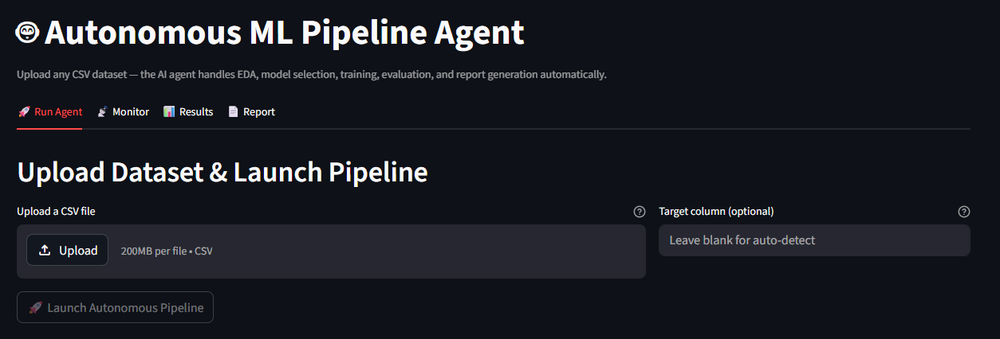

# Autonomous ML Pipeline Agent

> Drop any CSV dataset — an AI agent (Claude Sonnet + LangGraph) autonomously runs EDA, selects models, trains, evaluates, logs to MLflow, and writes a full report. No code required.


---

## What it Does

Upload a CSV. The agent handles the rest:

1. **Loads and understands** the dataset — shape, types, missing values, problem type detection
2. **Runs EDA** — statistics, correlation heatmap, class distribution, feature distributions
3. **Selects models** — decides which algorithms to try based on what it finds
4. **Trains multiple models** — Logistic Regression, Random Forest, XGBoost (with SMOTE if imbalanced)
5. **Evaluates and compares** — accuracy, F1, ROC-AUC, confusion matrices, feature importance
6. **Logs to MLflow** — every run tracked with parameters, metrics, and plots
7. **Writes a report** — Claude Sonnet generates a professional narrative analysis



---

## Architecture

```
+-----------------------------------------------------------------------+
|                          Docker Compose                               |
|                                                                       |
|  +-----------+   +-----------+   +------------+   +-----------+       |
|  | Streamlit |-->|  FastAPI  |-->|   Celery   |   |  MLflow   |       |
|  |   :8502   |   |   :8001   |   |   Worker   |   |   :5002   |       |
|  +-----------+   +-----------+   +-----+------+   +-----------+       |
|                        ^               |                              |
|                   +----+----+     +----v-----------------------+      |
|                   |  Redis  |     |   LangGraph ReAct Agent    |      |
|                   |  :6379  |     |                            |      |
|                   +---------+     |   Claude Sonnet            |      |
|                                   |         |                  |      |
|                                   |   +-----v--------------+  |       |
|                                   |   | load_dataset       |  |       |
|                                   |   | run_eda            |  |       |
|                                   |   | train_model        |  |       |
|                                   |   | evaluate_model     |  |       |
|                                   |   | log_to_mlflow      |  |       |
|                                   |   | generate_report    |  |       |
|                                   |   +--------------------+  |       |
|                                   +----------------------------+      |
+-----------------------------------------------------------------------+
```

---

## Demo — OCT Defect Prediction Dataset

The primary demo uses results from the companion project ([VLM OCT Defect Inspector](https://github.com/irtaza091996/vlm-oct-inspector)):

**Task:** Predict when a Vision Language Model fails (`both_correct = False`) using features like defect pixel ratio, sample identity, and VLM confidence score.

**What the agent found:**
- Class imbalance detected (8.1% failure rate) — SMOTE applied automatically
- XGBoost selected as best model: ROC-AUC 0.89, F1 0.53 on the minority class
- Top predictor: `gt_defect_pixel_ratio` — the VLM struggles most on subtle defects (<2% of pixels)
- `vlm_confidence < 0.70` flags 58% of failures while flagging only 9% of all images

---

## Tech Stack

| Component | Tool |
|-----------|------|
| Agent brain | Claude Sonnet 4.6 via LangGraph ReAct |
| Agent framework | LangChain + LangGraph |
| ML models | scikit-learn, XGBoost, imbalanced-learn (SMOTE) |
| Task queue | Celery + Redis |
| Backend API | FastAPI |
| Frontend | Streamlit (4-tab dashboard) |
| Experiment tracking | MLflow |
| Report generation | Claude Sonnet 4.6 |
| Infrastructure | Docker Compose (5-service stack) |

---

## Project Structure

```
autonomous-ml-agent/
├── app/
│   ├── agent.py            # LangGraph ReAct agent definition
│   ├── config.py           # API keys, paths, model names
│   ├── main.py             # FastAPI endpoints
│   ├── tasks.py            # Celery task definitions
│   └── tools/
│       ├── loader.py       # load_dataset tool
│       ├── eda.py          # run_eda tool
│       ├── trainer.py      # train_model tool
│       ├── evaluator.py    # evaluate_model tool
│       ├── mlflow_logger.py # log_to_mlflow tool
│       └── reporter.py     # generate_report tool
├── frontend/
│   └── streamlit_app.py    # 4-tab dashboard
├── docker-compose.yml
├── Dockerfile
└── requirements.txt
```

---

## Quick Start

**Prerequisites:** Docker Desktop, Anthropic API key (~$0.05-0.10 per run)

### 1. Clone and configure
```bash
git clone https://github.com/irtaza091996/autonomous-ml-agent.git
cd autonomous-ml-agent
cp .env.example .env
# Add your ANTHROPIC_API_KEY to .env
```

### 2. Start services
```bash
docker compose up -d
```

| Service | URL |
|---------|-----|
| Dashboard | http://localhost:8502 |
| API Docs | http://localhost:8001/docs |
| MLflow | http://localhost:5002 |

### 3. Run the agent
1. Open **http://localhost:8502**
2. Upload any CSV file
3. Set the target column (or leave blank for auto-detect)
4. Click **Launch Autonomous Pipeline**
5. Watch the agent reason step by step in the **Monitor** tab

---

## API Usage

### Submit a job
```bash
curl -X POST http://localhost:8001/jobs \
  -F "file=@your_dataset.csv" \
  -F "target_column=your_target"
```

### Poll for status
```bash
curl http://localhost:8001/jobs/{job_id}
```

### Get metrics
```bash
curl http://localhost:8001/jobs/{job_id}/metrics
```

### View report
Open `http://localhost:8001/jobs/{job_id}/report` in your browser.

---

## How the Agent Reasons

The agent uses a ReAct (Reason + Act) loop. At each step it thinks, calls a tool, then thinks again based on the result:

```
Thought: "I need to understand the dataset first."
Action:  load_dataset(job_id="abc123", target_column="auto")
Result:  "Shape: 1494x24. Binary classification. Imbalance: 8.1%"

Thought: "Imbalance detected. I should use SMOTE and try XGBoost with scale_pos_weight."
Action:  run_eda(job_id="abc123")
Result:  "High correlation between vlm_confidence and failures..."

Thought: "I will train all three classifiers with SMOTE enabled."
Action:  train_model(job_id="abc123", model_name="xgboost", use_smote=True)
...
```

The agent adapts its strategy based on what it discovers in the data — it is not a fixed script.

---

## Supported Problem Types

| Type | Models |
|------|--------|
| Binary classification | Logistic Regression, Random Forest, XGBoost |
| Multi-class classification | Logistic Regression, Random Forest, XGBoost |
| Regression | Ridge, Random Forest, XGBoost |

Problem type is auto-detected from the target column. SMOTE is applied automatically when class imbalance is detected.

---

## Cost Per Run

| Step | Estimated Cost |
|------|---------------|
| Agent reasoning (~8 steps) | ~$0.04 |
| Report generation (1 call) | ~$0.02 |
| ML training (local Docker) | $0.00 |
| **Total per run** | **~$0.05-0.10** |

---

## Related Projects

- **Part 1 — [VLM OCT Defect Inspector](https://github.com/irtaza091996/vlm-oct-inspector)**: Zero-shot VLM evaluation on industrial OCT defect data; results feed into this project as the primary demo dataset
- **U-Net Baseline — [Defect Detection 3D Printing](https://github.com/irtaza091996/Defect-Detection-3DPrinting)**: Trained segmentation models (U-Net, DeepLabV3+) that serve as the benchmark for the VLM project

---

*Muhammad Irtaza Khan — 2026*
